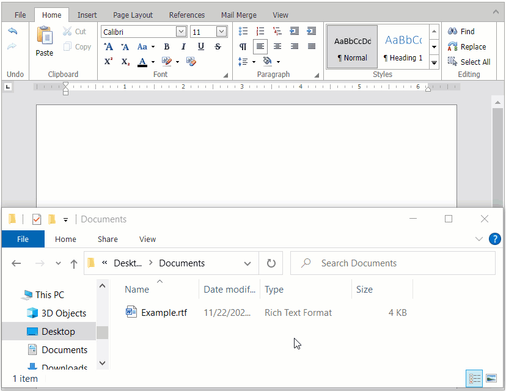

<!-- default badges list -->

<!-- default badges end -->
# Rich Text Editor for ASP.NET Web Forms - How to open a document using drag and drop

This example allows users to drag files to the [Rich Text Editor](https://docs.devexpress.com/AspNet/DevExpress.Web.ASPxRichEdit.ASPxRichEdit) to open them in the control. In this example, **Open** and **Save As** operations are unavailable since the [work directory](https://docs.devexpress.com/AspNet/DevExpress.Web.ASPxRichEdit.ASPxRichEdit.WorkDirectory?p=netframework) is not specified.

The [Upload Control](https://docs.devexpress.com/AspNet/DevExpress.Web.ASPxUploadControl) allows users to upload files from a client computer and save them on the server. Set the control's [EnableDragAndDrop](https://docs.devexpress.com/AspNet/DevExpress.Web.UploadAdvancedModeSettings.EnableDragAndDrop) property to `true` to enable drag and drop support. Assign the ASPxRichEdit control's identifier to the Upload control's [ExternalDropZoneID](https://docs.devexpress.com/AspNet/DevExpress.Web.UploadAdvancedModeSettings.ExternalDropZoneID) property to upload files that users drag in the Rich Text Editor.

Once the file upload operation complites, use the [RichEditDocumentServer](https://docs.devexpress.com/OfficeFileAPI/17488/word-processing-document-api) to save the file's content to a stream. Pass the stream to the [Open](https://docs.devexpress.com/AspNet/DevExpress.Web.ASPxRichEdit.ASPxRichEdit.Open(System.String-DevExpress.XtraRichEdit.DocumentFormat-System.Func-System.IO.Stream-)) method to open this document in the Rich Text Editor.

## Files to Review

* [Default.aspx](./CS/Default.aspx) (VB: [Default.aspx](./VB/Default.aspx))
* [Default.aspx.cs](./CS/Default.aspx.cs) (VB: [Default.aspx.vb](./VB/Default.aspx.vb))

## Documentation

- [How to upload a document in the working directory using drag-and-drop](https://docs.devexpress.com/AspNet/119383/components/rich-text-editor/examples/how-to-upload-a-document-in-the-working-directory-using-drag-and-drop)
- [File Upload - Drag and Drop](https://docs.devexpress.com/AspNet/17726/components/file-management/file-upload/concepts/drag-and-drop)
- [Rich Text Editor - Document Management](https://docs.devexpress.com/AspNet/401562/components/rich-text-editor/document-management)

## More Examples

- [How to save/load documents to/from a database](https://github.com/DevExpress-Examples/asp-net-web-forms-richedit-work-with-database)
